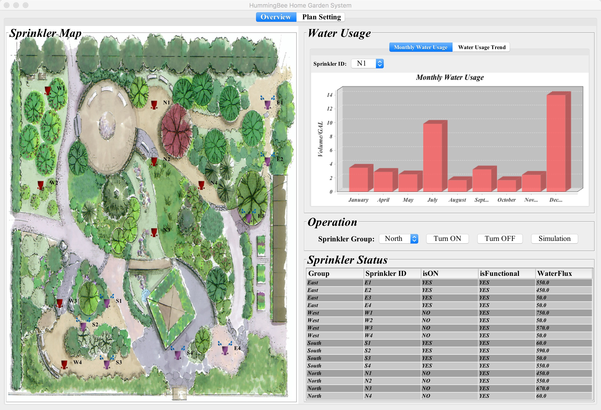
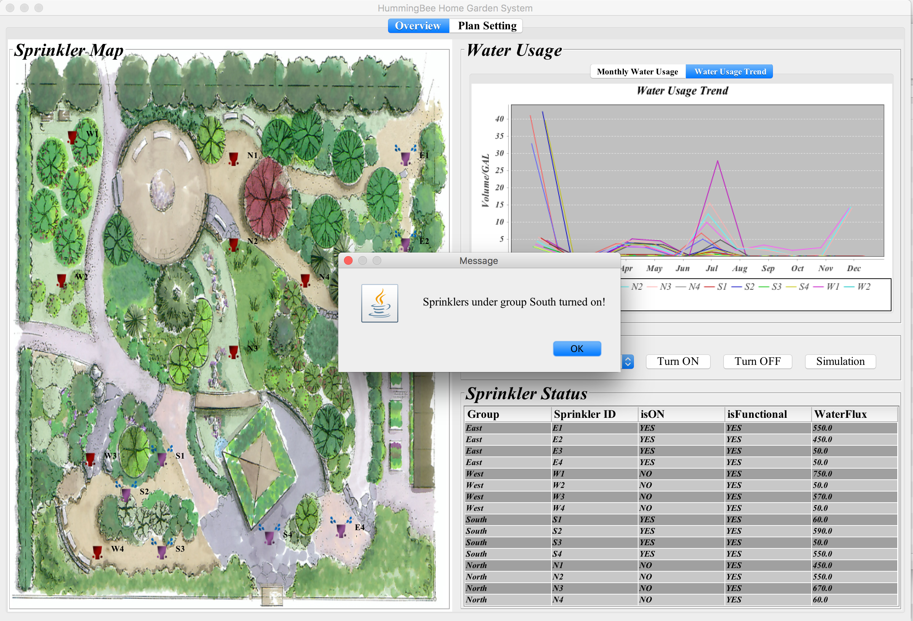
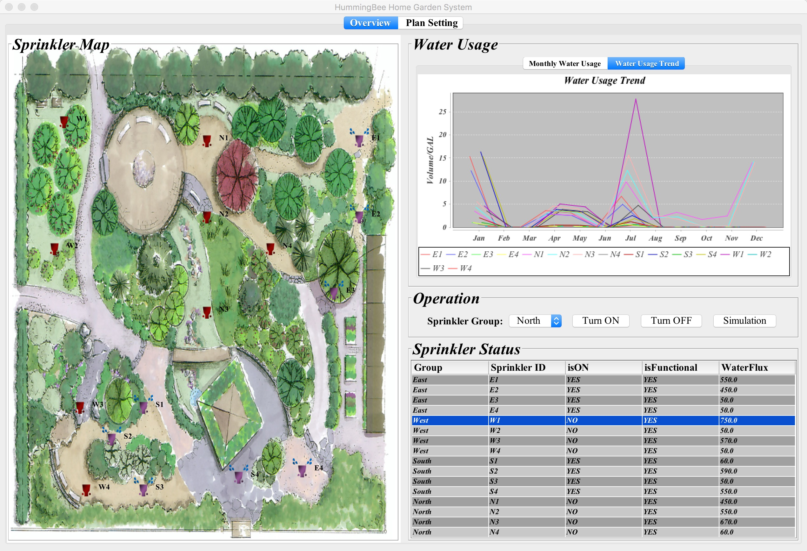
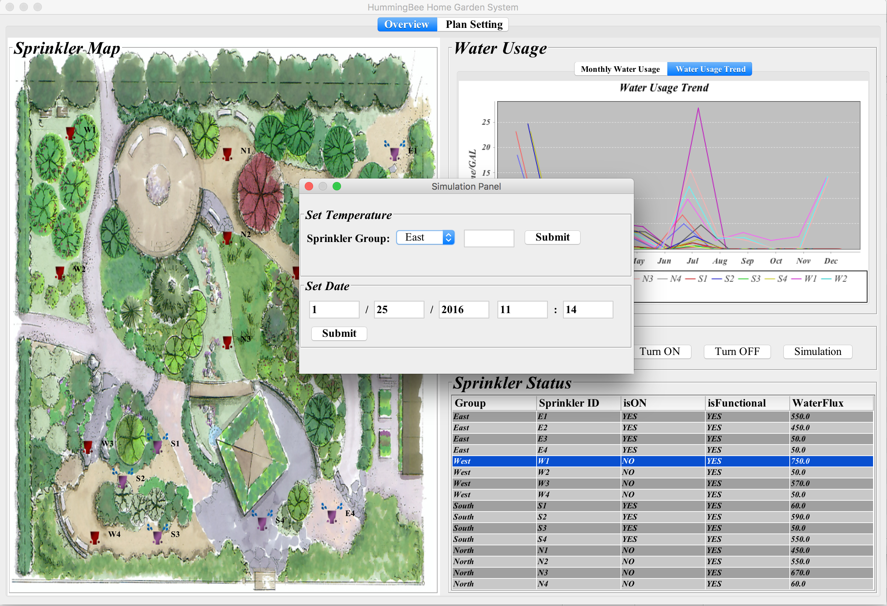
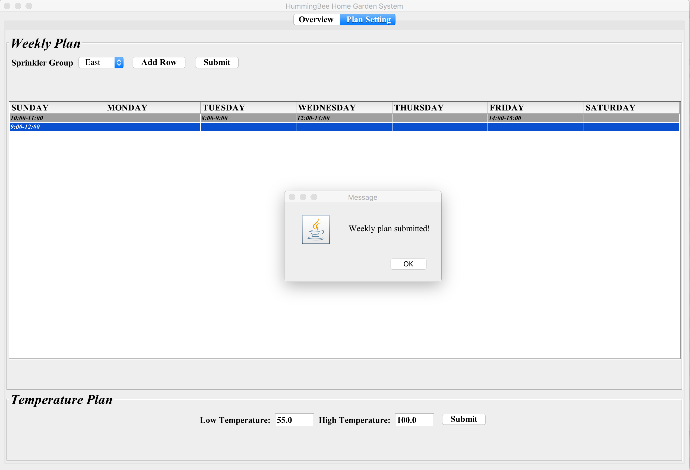

# HomeGarden
HomeGarden Sprinkler System is developed in Java language based on OO(Object Oriented) Analysis and Design techniques.The implementation is a computer-based simulation of the Sprinkler system, where the various sensors, their functionality, the control panel to arm and program the system are simulated using a Graphic User Interface. 

# Functionality
HomeGarden Sprinkler System provides functionalities including:

* Display a map of garden layout, the location and the status of all sprinklers.
* Show each sprinkler detail status in a table, and the waterflux can be adjusted easily
* Activate and deactivate sprinkler individually or in group. 
* Present sprinkler monthly water usage in bar graph, and the water usage trending is also available
* Activate and deactivate the sprinklers automatcially according to the weekly plan which you can add, update and delete.
* Monitor the sprinklers by temperature sensors with higher and lower bounds. Sprinklers are automatically activated when the temperature is above the higher bounds and deactivated when the temperature is under the lower bounds.
* Provide temperature and date simulation to quickly set current temperature and date

	
# How to use
This project stores data such as sprinkler information in the MySQL database, so you need to provide basic database information to run this project.

Run the following command at the project directory:

*java -splash:resources/pictures/splash.jpeg -jar homegarden.jar <db_user> <db_password> <db_port>*
	
# Screenshots

# Dependencies
* [JFreechart](http://www.jfree.org/jfreechart/)
* [MySQL JDBC](https://dev.mysql.com/doc/connector-j/5.1/en/connector-j-usagenotes-connect-drivermanager.html)

# License

Copyright 2016 Shuang Ma

Licensed under the Apache License, Version 2.0 (the "License");
you may not use this file except in compliance with the License.
You may obtain a copy of the License at

   http://www.apache.org/licenses/LICENSE-2.0

Unless required by applicable law or agreed to in writing, software
distributed under the License is distributed on an "AS IS" BASIS,
WITHOUT WARRANTIES OR CONDITIONS OF ANY KIND, either express or implied.
See the License for the specific language governing permissions and
limitations under the License.

